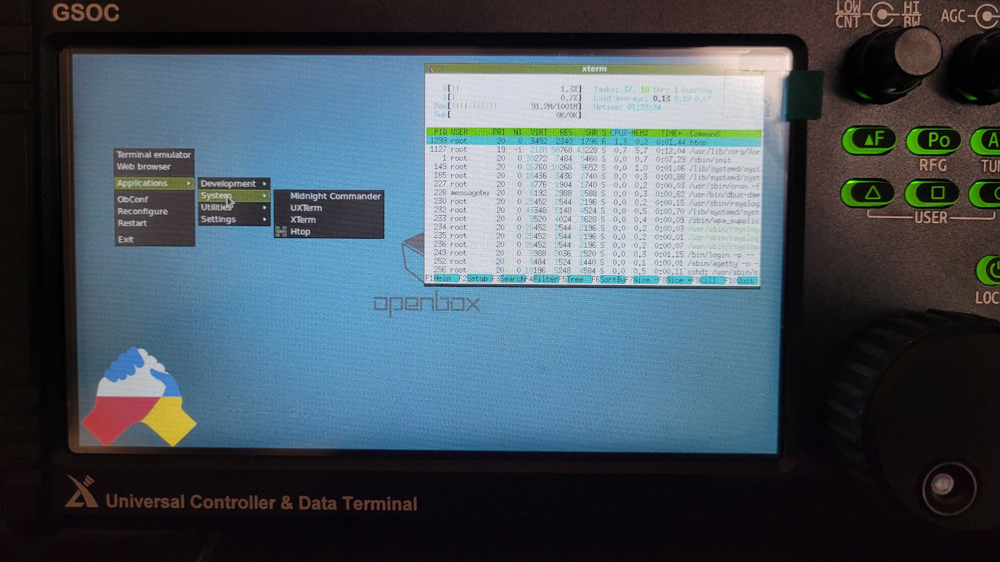

# This branch is for experimenting running and interacting with gsoc-app-v1 as a non-root user.

# gsoc-puhumod

Xiegu GSOC Debian hack a.k.a **puhuMod**. puhu originated from "**путін хуй**".

THE SOFTWARE IS PROVIDED "AS IS", WITHOUT WARRANTY OF ANY KIND, EXPRESS OR 
IMPLIED, INCLUDING BUT NOT LIMITED TO THE WARRANTIES OF MERCHANTABILITY, FITNESS
 FOR A PARTICULAR PURPOSE AND NONINFRINGEMENT. IN NO EVENT SHALL THE AUTHORS OR 
COPYRIGHT HOLDERS BE LIABLE FOR ANY CLAIM, DAMAGES OR OTHER LIABILITY, WHETHER 
IN AN ACTION OF CONTRACT, TORT OR OTHERWISE, ARISING FROM, OUT OF OR IN 
CONNECTION WITH THE SOFTWARE OR THE USE OR OTHER DEALINGS IN THE SOFTWARE.

This mod requires Xiegu GSOC firmware update image v1.3. G90 firmware should not
 be greater than v1.78b01

Before moving on please visit those repositories: 

* [https://github.com/mdubinko/gsoc-contrib](https://github.com/mdubinko/gsoc-contrib)
* [https://github.com/zeroping/xiegu-g90-headprotocol/](https://github.com/zeroping/xiegu-g90-headprotocol/)

All informations regarding SD card images, GSOC hardware, jailbreaking, 
head <-> panel protocol are already there. There is no need to duplicate that 
knowledge and they require recognition as it would not be possible to start this 
project without them.

| Feature  | Description | Link |
|:--------:|:------------|-----:|
| USB boot | Procedure for using USB sticks instead of SD card | [DONE](usb_boot/)|
| SD card boot | Standard SD card boot | [DONE](sdcard_boot/)|
| Debian | Debian 11 for GSOC Xiegu | [DONE](debian/) |
| Release | Ready to use binary images  | WIP |
| Bluetooth | Bluetooth support  | WIP |
| Native CAT| Native cat support over Wifi/BT  | WIP |

73!
